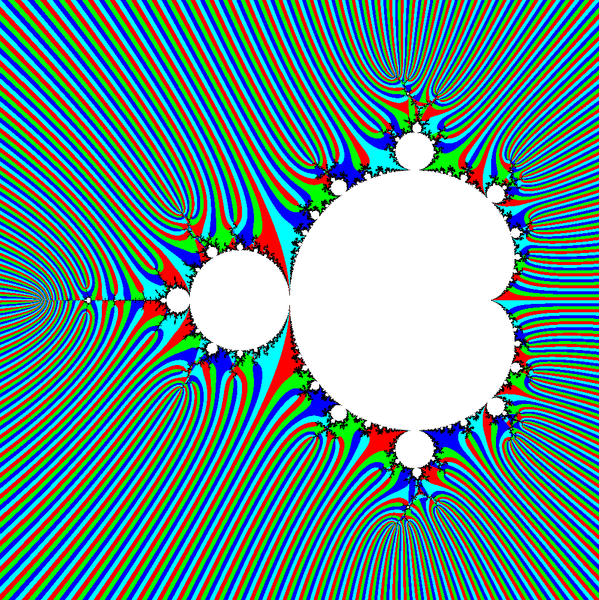
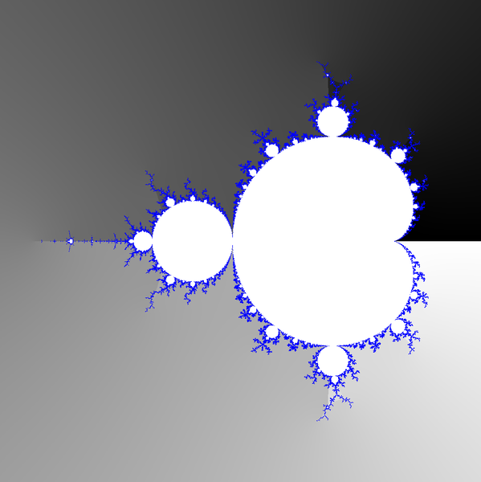
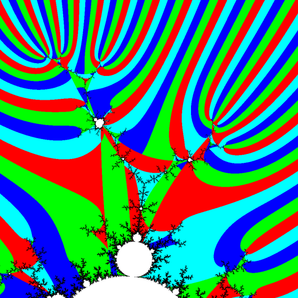
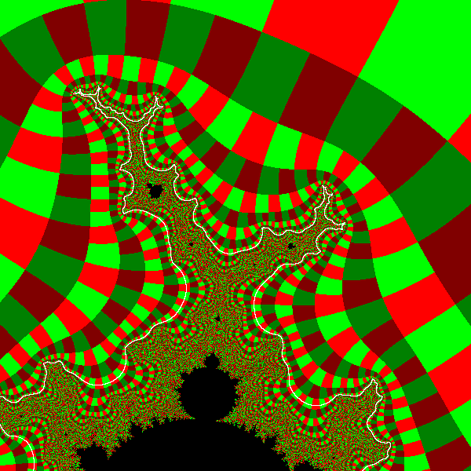
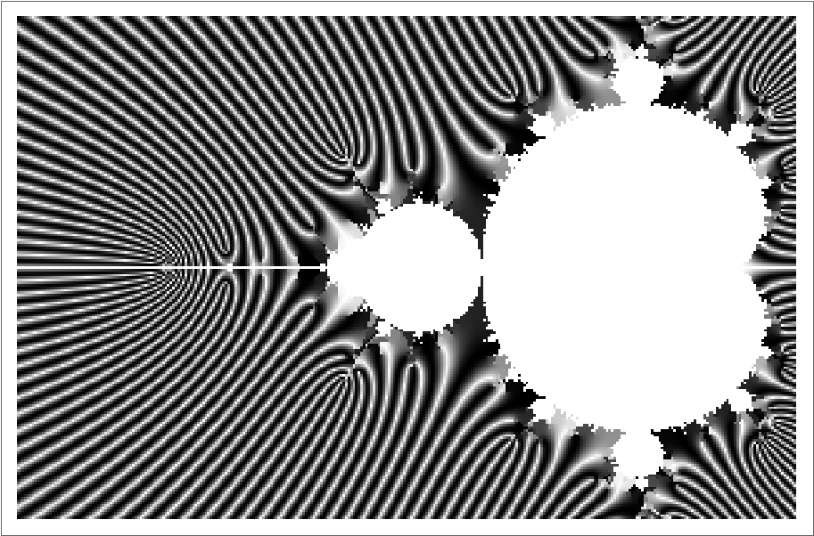

TOC
* [Which points of parameter have external angle ?](README.md#which-points-of-parameter-have-external-angle-)
* [What is the external angle ?](angle.md#what-is-the-external-angle-)
* [How to compute the external angle?](README.md#how-to-compute-the-external-angle)
  * [series expansion formula ](README.md#series-expansion-formula-for-computing-external-angle)
  * [trace external ray outwards on the parameter plane and collect bits ](README.md#trace-external-ray-outwards-on-the-parameter-plane) - the best method ?
  * [Douady and Hubbard method](README.md#douady-and-hubbard-method-for-c-near-the-real-axis)
  * [Stripe Average Coloring (or Method) = SAM or SAC](README.md#stripe-average-coloring-or-method-sam-or-sac) - good graphical result
  * [argument of the Boettcher coordinate](README.md#argument-of-the-boettcher-coordinate)
* [See also](README.md#see-also)
* Key words
* [technical notes](README.md#technical-notes)


# Which points of parameter have external angle ?

Points which have the external angle:
* point of the boundary of the Mandelbrot set ( landing point of the external ray ). It can have one or more external angles : biaccesible, triaccesible , ...
* point of the exterior of the Mandelbrot set ( only ona external angle) 

Points of the interior of Mandelbrot set ( interior of Mandelbrot set hyperbolic components) do not have external angle, but have internal angle.


# How to describe external angle ( proper fraction)?
* units ( [turns](https://en.wikipedia.org/wiki/Turn_(geometry)), radians, degrees)
* [number, it's base,type and expansion](https://en.wikibooks.org/wiki/Fractals/Mathematics/Numbers#base_and_expansion_of_the_number)
* dynamics of the fraction under angle doubling map: (pre)periodic/non-periodic 


# Tasks related with external angle
* compute external angle of the point c
* draw external angle thru the point c from the exterior
* find which external rays land on the point c from the boundary
* draw external angle from the infinity toward boundary 


# How to compute the external angle?

Methods for the boundary points:
* Schleicher algorithm 
* Combinatorial algorithm = Devaney's method for [the angles of the wake](https://en.wikibooks.org/wiki/Fractals/Iterations_in_the_complex_plane/wake) 
* [tuning algorithm by Douady](http://www-personal.umich.edu/~kochsc/douady.pdf)
  * [subwake](https://en.wikibooks.org/wiki/Fractals/Iterations_in_the_complex_plane/subwake)
* [outer algorithm by Pastor](http://www.tic.itefi.csic.es/gerardo/publica/Pastor07a.pdf)


Methods for the exterior points:
* by direction
  * inwards ( from infinity towards point on the boundary of the Mandelbrot set)
  * outwards ( from the point c towards infinity)
* by algorithm
  * [series expansion formula ](README.md#series-expansion-formula-for-computing-external-angle)
  * trace external ray outwards on the parameter plane
    * [trace external ray outwards on the parameter plane and collect bits ](README.md#trace-external-ray-outwards-on-the-parameter-plane) - the best method ?
    * trace external ray outwards on the parameter plane and compute argument of last point 
  * [Douady and Hubbard method](README.md#douady-and-hubbard-method-for-c-near-the-real-axis)
  * [Stripe Average Coloring (or Method) = SAM or SAC](README.md#stripe-average-coloring-or-method-sam-or-sac) - good graphical result
  * [argument of the Boettcher function](README.md#argument-of-the-boettcher-function)


## trace external ray outwards on the parameter plane and compute argument of last point 

> The lines of constant phase are exactly what is referred to as the Douady-Hubbard 'external rays'. With a tiny bit of math, its easy to see that these lines of constant phase are exactly perpendicular to the equipotential lines. 

[Linas Vepstas](https://linas.org/art-gallery/escape/ray.html)

> draw ... the external rays in such a way that they are perpendicular to the escape lines

[M. Romera et all  in A Method to Solve the Limitations in Drawing External Rays of the Mandelbrot Set](https://www.researchgate.net/publication/258389622_A_Method_to_Solve_the_Limitations_in_Drawing_External_Rays_of_the_Mandelbrot_Set)


[Two methods:](https://www.khanacademy.org/math/multivariable-calculus/multivariable-derivatives/partial-derivative-and-gradient-articles/a/the-gradient)
* "Choose a fixed step size, and find the direction such that a step of that size increases/decreases f the most."
* "Choose a fixed increase in f, and find the direction such that it takes the shortest step to increase f by that amount."


Links: 
* https://commons.wikimedia.org/wiki/File:Coordinate_descent.svg
* http://paulbourke.net/papers/conrec/
* http://www.mndynamics.com/indexp.html#XR
* https://stackoverflow.com/questions/27258941/equal-density-points-in-a-high-dimensional-space/27550398#27550398
* http://www.isep.pw.edu.pl/~ambor/Pomoce/gradientowe.htm

## series expansion formula for computing external angle

$`arg_M(c) = arg(c) + \sum_{n=1}^\infty \left( \frac{1}{2^n}*arg \left( \frac{f_c^n(c)}{f_c^n(c)-c}     \right ) \right )  `$


> The principal value of the argument is the unique angle with -π<arg(z)≤π. 
> This definition is used because a function should be single-valued. 
> However, a discontinuity is introduced artificially when a point z is crossing the negative real axis, 
> say going from i through -1 to -i: its argument should go from π/2 through π to 3π/2, 
> but the principal value goes from π/2 to π, jumps to -π, and goes to -π/2. 

  [Wolf Jung](http://www.mndynamics.com/indexp.html#XR)
  
  
Note that result ot the arg function can have positive or negative sign so sum can be greater or lower then arg(c) !








Here one can see errors in computing : compare with [Stripe Average Coloring ](README.md#stripe-average-coloring-or-method-sam-or-sac) 





One can see on the binary decomposition image that errors are in the chaotic region, where "our image looks noisy and grainy near the boundary of the Mandelbrot set" (Claude Heiland-Allen )


Code:

```c

/*
 Fc(z) = z*z + c
 z= x+y*i
 c= a+b*i
 This function computes external argument of point C in turns
 for mandelbrot set for Fc(z)= z*z + c
 external argument = Arg(Phi(c))
 1 [turn] = 360 [degrees] = 2* M_PI [radians]
 this function is based on function mturn from mbrot.cpp 
 from old (probably 5.2 of May 17, 2008) version of program mandel by Wolf Jung
 http://www.iram.rwth-aachen.de/~jung/indexp.html 

Already checked that escaping. Requires z = c instead of z = 0
 http://fraktal.republika.pl/cpp_argphi.html
 algorithm: http://www.mndynamics.com/indexp.html#XR

this formula will be valid not only for large |z| 

*/
double mturn(double complex c)
{ 
  int j; 
  int jMax = 100;
  
  double s = 1.0; // = 1/(2^n)
  double dr = 1.0/2.0; 
  double theta; 
  // z-c 
  double u; // creal(z-c)
  double v; // cimag(z-c)
  
  double r; //   r here means r^2 = cabs(z)* cabs(z)
  
  // z = x+y*I 
  double x; 
  double y;
  
  // c = cx + cy*I        
  double cx = creal(c);
  double cy = cimag(c);        
  
  
  
  
  // Requires z = c instead of z = 0
  x = cx;
  y = cy; 
  
  // theta = arg(z)
  theta = atan2(y, x);
  
  // compute the sum 
  for (j = 1; j < jMax; j++)
  { 
    s *= dr;
    // z=Fc(z)
    double temp = x*x - y*y + cx;
    y = 2*x*y + cy;
    x = temp; 
    
    // r here means r^2 = cabs(z)* cabs(z) 
    r = x*x  + y*y; // 
    if (r < .0001) return -7; // ?
    
    
    // z-c
    u = x - cx; 
    v = y - cy;
    
    
    
    // atan2 here is computing  arg(z/(z-c))
    // s*atan2 means : theta/(2^n)
    // theta += is summation
    theta += s * atan2(u*y - v*x, u*x + v*y);
    //
    if (r/s > 1e25) break; // prevent -nan
  }
  
  
  //if (r < 1000) return -6; // ? lazy escaping ???, 
  //
  theta *= (.5/M_PI); // convertion to turns 
  //
  theta -= floor(theta); // modulo 1 
  
  return theta;
  
  
}//mturn
```


atan2(y/x) = Returns the principal value of the arc tangent of y/x, expressed in radians


How to compute arg(z/(z-c)) in a fast way?

simlify z/(z-c)

```c
z = x+y*I
arg(z) = atan2(y,x) 
z-c = u+v*I // b 
arg(z/(z-c)) = arg(z/b)
```

Here is Maxima CAS code:   
```
(%i2) z:x+y*%i;
(%o2)            	%i y + x
(%i3) b:u+v*%i;
(%o3)            	%i v + u
(%i4) creal(z/b); 
	                      %i y + x
(%o4)                   creal(--------)
                              %i v + u
(%i5) realpart(z/b);
                              v y + u x
                              ---------
                               2    2
                              v  + u
(%i6) imagpart(z/b);
                             u y - v x
                             ---------
                              2    2
                             v  + u


```

Denote :

$`z/b = rn/rd + I*in/id`$

notice that

$`atan2(in/id, rn/rd) = atan2(in, rn)`$

Now one can skip:
* 2 divisions : in/id and rn/rd
* 2 multiplications : $`v*v`$ and u*u
* 1 addition $`v^2+u^2`$


Files:
* [mturn.c](mturn.c) - c file
* [mturn.png](mturn.png) - whole set using palette colors
* [mturng.png](mturng.png) - whole set using gray colors
* [mturn3.png](mturn3.png) - zoom of wake 1/3 using palette colors

Links:
* [description and cpp code by Wolf Jung](http://www.mndynamics.com/indexp.html#XR)
* [How to process branch cut lines of Böttcher function](http://math-functions-1.watson.jp/sub4_math_020.html#section030) by Souichiro-Ikebe
* [argphi](http://fraktal.republika.pl/cpp_argphi.html)


## trace external ray outwards on the parameter plane
>"mostly adopted a calculation method (of the external angle is) to trace the curve of the external ray" 

Souichiro-Ikebe ( automatic translation)  


>Testing shows the original atan2() is only accurate to around 16 bits, (so) bit collection when passing dwell bands is much more accurate.
```cpp
double externalAngle(...) {
...
	return (std::atan2(cy,cx));
}
```
>This gets you the angle in only double-precision, but using double precision floating point throughout it's possible to get the external angle in much higher precision 
>* the trick is to collect bits from the binary representation of the angle as you cross each dwell band 
>* whether the final iterate that escaped has a positive or negative imaginary part determines if the bit is 0 or 1 respectively, see [binary decomposition colouring](http://www.mrob.com/pub/muency/binarydecomposition.html)   

>You need to trace a ray outwards, which means using different C values, and the bits come in reverse order, first the deepest bit from the iteration count of the start pixel, then move C outwards along the ray
>(perhaps using [the newton's method of mandel-exray.pdf](http://www.math.titech.ac.jp/~kawahira/programs/mandel-exray.pdf) in reverse), repeat until no more bits left.  you move C a fractional iteration count each time, and collect bits when crossing integer dwell boundaries


>it is asymptotically too slow to be practical: [$`O(n^2)`$](https://en.wikipedia.org/wiki/Big_O_notation) where n is the sum of the preperiod and period of the external angle.

Claude Heiland-Allen
* [blog](http://mathr.co.uk/blog/)
* [FF: smooth-external-angle-of-mandelbrot-set](http://www.fractalforums.com/programming/smooth-external-angle-of-mandelbrot-set/15/)  


See also:
* [binary-decomposition-and-external-angles](http://www.fractalforums.com/animations-showcase-(rate-my-short-animation)/binary-decomposition-and-external-angles/)
* [external-angle-contours](http://www.fractalforums.com/animations-showcase-(rate-my-short-animation)/external-angle-contours/)


Code:
* [tavis.cpp ](tavis.cpp) - compute external angle of point cx, cy


## argument of the Boettcher coordinate

One can use argument of [Boettcher coordinate](boettcher.md) for computing external argument (angle). 


[Mathematica ](https://lab.wolframcloud.com/app/objects/4ef1f57b-368e-41ab-bd5e-dee05dd9b7c3) [Boettcher function](http://reference.wolfram.com/language/ref/MandelbrotSetBoettcher.html) 

```
ArrayPlot[Table[Sin[100 Arg@MandelbrotSetBoettcher[x + I*y]], {y, -1, 1, .01}, {x, -2.6, .5, .01}], ImageSize->Full]
```

the result:

 



##  Douady and Hubbard method for c near the real axis

[Douady A. (1986) Julia Sets and the Mandelbrot Set. In the book : The Beauty of Fractals. Springer, Berlin, Heidelberg, Print ISBN 978-3-642-61719-5](https://link.springer.com/chapter/10.1007/978-3-642-61717-1_13)

>
Douady and Hubbard found a simple method for computing external angles for values of c outside of M and near the real axis. Call such an angle 2Pi*Ray, where 0 <= Ray < 1.   
The number Ray can be written as a binary decimal, i.e, as a sequence of zeroes and ones. 
To find it, consider the sequence {Arg[c], Arg[c^2 +c], Arg[(c^2 + c)^2 + c], ...}.  


We replace Arg[z] by
* 0 if 0 <= Arg[z] < Pi, 
* 1 otherwise


Here is some Mathematica code for this.
```
    c = -.75 +.0001*I; 
    z = 0;
    Do[z = z^2 + c; Print[Abs[Floor[Arg[z]/Pi]]], {n, 1, 10}]
```   
This produces the sequence {0, 1, 0, 1, 0, 1, 0, ...} which is the binary expansion for 1/3  
For c = -.75 - .0001*I produces {1, 0, 1, 0, 1, 0, 1, ...} which is the binary expansions for 2/3.  
The point c0 = -.75 is the root of the period 2 bud. There are two rays leading inward to it, one coming from above and one from below. The two values of c we have chosen lie on or very near these two rays.
>  
   
[Douglas C. Ravenel](https://web.math.rochester.edu/people/faculty/doug/oldcourses/215s98/lecture10.html)


Files:
* [douady.c ](douady.c) - c file wich checks Douady-Hubbard method
* [morse.mac ](morse.mac) - batch file for Maxima cas which computes upper angles of external rays which land on the roots of the period doubling cascade on the real axis


## Stripe Average Coloring (or Method) = SAM or SAC


Links:
* [wikibooks ](https://en.wikibooks.org/wiki/Fractals/Iterations_in_the_complex_plane/stripeAC)
* [gitlab repo ](https://gitlab.com/adammajewski/mandelbrot_wiki_ACh)
* [wiki by Arnaud Cheritat](https://www.math.univ-toulouse.fr/~cheritat/wiki-draw/index.php/Mandelbrot_set)
* [commons - whole set](https://commons.wikimedia.org/wiki/File:Mandelbrot_set_-_Stripe_Average_Coloring.png)
* [commons - wake 1/3](https://commons.wikimedia.org/wiki/File:Stripe_Average_Coloring_-_Mandelbrot_set_zoom_(_wake_1over3_).png)


Files:
* [samm.c](samm.c) - c file
* [samm.png](samm.png)
* [samm3.png](samm3.png)


# See also
* [Computing external dynamic angle](https://gitlab.com/adammajewski/dynamic_external_angle)
* [parameter ray_in using Newton method and mpfr library in c ](https://gitlab.com/c_files/parameter_ray_in_newton_mpfr)
* [NonInteractive Parameter Ray_In MPFR](https://gitlab.com/adammajewski/NonInteractiveParameterRayInMPFR)
* [External angles in the Mandelbrot set: the work of Douady and Hubbard. by Professor Douglas C. Ravenel](https://web.math.rochester.edu/people/faculty/doug/oldcourses/215s98/lecture10.html)
* [Plotting field lines during iteration by Chris Thomasson](http://www.fractalforums.com/new-theories-and-research/plotting-field-lines-during-iteration)


# Key words
* discrete local complex dynamics
* complex quadratic polynomial
* basin of attraction of infinity
* basin of attraction of superattracting fixed point


# technical notes
GitLab uses:
* the Redcarpet Ruby library for [Markdown processing](https://gitlab.com/gitlab-org/gitlab-ce/blob/master/doc/user/markdown.md)
* [KaTeX](https://khan.github.io/KaTeX/) to render [math written with the LaTeX syntax](https://gitlab.com/gitlab-org/gitlab-ce/blob/master/doc/user/markdown.md), but [only subset](https://khan.github.io/KaTeX/function-support.html). [Here is used version](https://github.com/gitlabhq/gitlabhq/blob/a0715f079c143a362a7f6157db45020b8432003e/vendor/assets/javascripts/katex.js)


## git ( gitlab)

```
cd existing_folder
git init
git remote add origin git@gitlab.com:adammajewski/parameter_external_angle.git
git add .
git commit -m "Initial commit"
git push -u origin master
```

