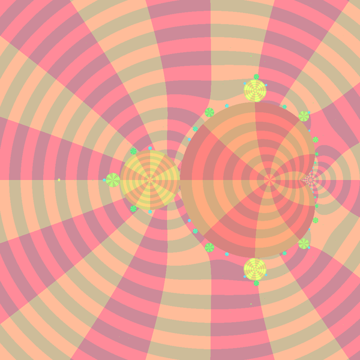
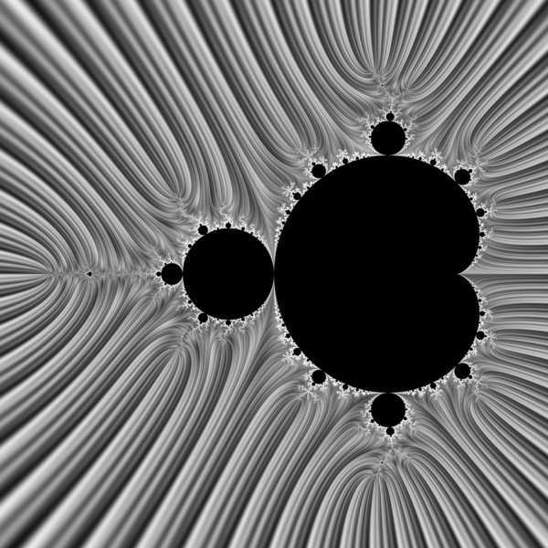

# The Böttcher function
The Böttcher function:
* maps the complement of the Mandelbrot set (or the filled Julia set)  conformally to the complement of the closed unit disk.
* is a solution of [Boettcher's functional equation](https://en.wikipedia.org/wiki/B%C3%B6ttcher%27s_equation), so in case of [complex quadratic map](https://en.wikipedia.org/wiki/Complex_quadratic_polynomial)

$`\Phi_c: C \setminus K_c \to \C \setminus D`$

$`\Phi_M: C \setminus M \to \C \setminus D`$

$`B(f(z)) = (B(z))^2`$

where:

 - B is Boettchers function
 - f is [complex quadratic map](https://en.wikipedia.org/wiki/Complex_quadratic_polynomial)


# Notation
* $`\Phi = B`$ is a Bottcher map ( function)
* $`arg`$ is the angle ( argument, phase) of complex number
* $`arg_M`$ is exernal angle on the parameter plane
* $`arg_c`$ is the external angle on the dynamic plane
* $`\Phi_c`$ is [the Boettcher map ](https://en.wikipedia.org/wiki/External_ray#Dynamical_plane_.3D_z-plane) on the dynamic plane
* $`\Phi_M`$ is [the Boettcher map ](https://en.wikipedia.org/wiki/External_ray#Dynamical_plane_.3D_z-plane) on the parameter plane
* the result of the Boettcher function is called Boettcher coordinate

# solutions of the Boettchers equation


Solutions: 
* closed form 
* aproximation ( series )

## closed form solutions

## aproximations


### asymptotic series approximation for the Böttcher function


[the Laurent series expansions](https://en.wikipedia.org/wiki/Formal_power_series#Formal_Laurent_series) of $`\Phi_M(c)`$ near infinity[by Alain Orbino](https://sites.math.washington.edu/~morrow/336_14/papers/alain.pdf)

$`\Phi_M(c) = c + a_0 + \frac{a_1}{c}+ + \frac{a_2}{c^2}+ . . . + + \frac{a_{k(n)}}{c^{k(n)}} `$

with 

$`k (n) = 2^{n+1} - 3`$


One can find it using:
* Mathematica function [MandelbrotSetBoettcher](http://reference.wolfram.com/language/ref/MandelbrotSetBoettcher.html)
* [lab.wolframcloud](https://lab.wolframcloud.com/app/objects/4ef1f57b-368e-41ab-bd5e-dee05dd9b7c3) 

[On the parameter plane](http://reference.wolfram.com/language/ref/MandelbrotSetBoettcher.html) : 

$`B_{M,3}(c) = c + \frac{1}{2} - \frac{1}{8c} + \frac{1}{16c^2} - \frac{5}{128c^3} + O(\frac{1}{c^4})`$

$`B_{M,4}(c) = c + \frac{1}{2} - \frac{1}{8c}        +5/(16 z^2)       -53/(128 z^3)       +127/(256 z^4)  -677/(1024 z^5)+O[1/z]^6`$

$`B_{M,5}(c) = c + \frac{1}{2} - \frac{1}{8c}        +5/(16 z^2)        -53/(128 z^3)        +127/(256 z^4)-677/(1024 z^5)+O[1/z]^6`$

```
Series[MandelbrotSetBoettcher[z], {z, \[Infinity], 3}]
z+1/2-1/(8 z)+1/(16 z^2) +O[1/z]^3
z+1/2-1/(8 z)+1/(16 z^2)- 5/(128 z^3)+O[1/z]^4
z+1/2-1/(8 z)+5/(16 z^2)-53/(128 z^3)+127/(256 z^4)-677/(1024 z^5)  +O[1/z]^6
z+1/2-1/(8 z)+5/(16 z^2)-53/(128 z^3)+127/(256 z^4)-677/(1024 z^5)+1965/(2048 z^6)+O[1/z]^7
z+1/2-1/(8 z)+5/(16 z^2)-53/(128 z^3)+127/(256 z^4)-677/(1024 z^5)+1965/(2048 z^6)-46797/(32768 z^7)+O[1/z]^8
z+1/2-1/(8 z)+5/(16 z^2)-53/(128 z^3)+127/(256 z^4)-677/(1024 z^5)+2221/(2048 z^6)-61133/(32768 z^7)+205563/(65536 z^8)+O[1/z]^9
z+1/2-1/(8 z)+5/(16 z^2)-53/(128 z^3)+127/(256 z^4)-677/(1024 z^5)+2221/(2048 z^6)-61133/(32768 z^7)+205563/(65536 z^8)-1394207/(262144 z^9)+O[1/z]^10
z+1/2-1/(8 z)+5/(16 z^2)-53/(128 z^3)+127/(256 z^4)-677/(1024 z^5)+2221/(2048 z^6)-61133/(32768 z^7)+205563/(65536 z^8)-1394207/(262144 z^9)+4852339/(524288 z^10)+O[1/z]^11
```





Boettcher and multiplier map on the parameter plane:
* The exterior of Mandelbrot set : near the set the image is not good, probaly more terms of Boettcher map are needed : $` O(\frac{1}{c^4})`$
*  interior : [Multiplier map](https://en.wikibooks.org/wiki/Fractals/Iterations_in_the_complex_plane/def_cqp#Multiplier_map) works good 


>
The series expansion of the inverse of  Phi_M(c)  does not work because it converges very slowly close to the boundary.  If it was faster,  M  would be known to be [locally connected](https://en.wikipedia.org/wiki/Mandelbrot_set#Local_connectivity).
>   
Wolf Jung


Compare it with [Stripe Average Coloring](README.md#stripe-average-coloring-or-method-sam-or-sac):




Files:
* [boettcher.c](boettcher.c) - c file


[On the dynamic plane](http://reference.wolfram.com/language/ref/JuliaSetBoettcher.html) : 

$`B_c(z) = z + \frac{0.05}{z} + \frac{0.02375}{z^3} - \frac{0.0036875}{z^5} + O(\frac{1}{z^6})`$


Different values are described by [Lauwerier, H. A. (Hendrik Adolf) in the book: Chaos by Arun V. Holden Princeton University Press, 14 lip 2014, page 79](https://books.google.pl/books?id=SvT_AwAAQBAJ&pg=PA49&lpg=PA49&dq=%22boettcher+function%22&source=bl&ots=KIAZpgX-9y&sig=r1OztpQT7ITgGWSwtBBG1ipvVyY&hl=pl&sa=X&ved=0ahUKEwj49_f2teDWAhWGa1AKHWu1BAkQ6AEIQjAD#v=onepage&q=%22boettcher%20function%22&f=false)

### computing argument and radius separtely


>" since the argument of the Boettcher function is not a main value but a value obtained by retaining multivalency, in fact, numerical calculation using this limit expression formula is very difficult. However, an infinite series easily obtained by transforming the limit expression formula"  


Souichiro-Ikebe ( automatic translation)  


$` \Phi_c(z) = \lim_{n\to \infty} (f_c^n(z))^{2^{-n}}  = R e^{i \theta}  = e^U e^{i \theta}`$


[argument of Boettcher coordinate ( = external angle)](README.md#series-expansion-formula-for-computing-external-angle): 

$`\theta = \theta_c(z) = arg(\Phi_c(z)) = arg_c(z) = arg(z) + \sum_{n=1}^\infty \left( \frac{1}{2^n}*arg \left(1 + \frac{c}{f_c^{n-1}(z)^2}     \right ) \right )  `$


Potential ( absolute value = radius = magnitude):

$`U = U_c(z) = log|\Phi_c(z)| =  log|z| + \sum_{n=1}^\infty \left( \frac{1}{2^n}*log \left|1 + \frac{c}{f_c^{n-1}(z)^2}     \right | \right )  `$


Links
* [Algorithm](https://en.wikibooks.org/wiki/Fractals/Iterations_in_the_complex_plane/boettcher#ArgPhi_-_External_angle_-_angular_component_of_complex_potential)
* Böttcher function by Souichiro-Ikebe
  * [description](http://math-functions-1.watson.jp/sub1_spec_390.html#section060)
  * [How to process branch cut lines of Böttcher function](http://math-functions-1.watson.jp/sub4_math_020.html#section030)
  * [FractalRelated.m ](the Mathematica-Package file " FractalRelated.m " in "Code of special function graph" of "File created in Version 8 ") - package of the Mathematica code


### n

(?????)

From the definitions:  
$`\Phi_M(c) = \Phi_c(c)`$  
$`arg_M(c)  = arg(\Phi_M(c)) `$  
$`arg_c(z) = arg(\Phi_c(z)) `$  
so [external angle of point c on the parameter plane is equal to external angle of the point z=c on the dynamic plane](https://en.wikipedia.org/wiki/External_ray)  
$`arg_M(c) = arg_c(z=c) = arg(\Phi_c(z= c)) = arg(\Phi_M(c)) `$
[//]: # "\Phi_M(c) \overset{def}{=} \Phi_c(c)`"


$` \Phi_c(z) = \lim_{n\to \infty} (f_c^n(z))^{2^{-n}} `$


Steps:
* on the parameter plane choose point c
* switch to the dynamic z-plane for c (not equal to zero)
  * take z= c 
  * check if it escapes = from exterior of filled Julia set
  * if yes: iterate z ( forward iteration  f_c(z) ) until it will be near infinity
  * remember number of final iteration when $`abs(z_n) > R_{limit} `$
  * switch plane to z-plane for c=0
* on the dynamic z-plane for c equal to zero
  * make n backward iterations 
  * angle of last z is aproximation of external angle 
  
  
  
Near infinity external angle of z is equal to angle of z so we can switch the plane


# See also similar topics:
* computing the external ray
* computing equipotential curve
* [computing the external angle](README.md) 


# technical note
GitLab uses:
* the Redcarpet Ruby library for [Markdown processing](https://gitlab.com/gitlab-org/gitlab-ce/blob/master/doc/user/markdown.md)
* [KaTeX](https://khan.github.io/KaTeX/) to render [math written with the LaTeX syntax](https://gitlab.com/gitlab-org/gitlab-ce/blob/master/doc/user/markdown.md), but [only subset](https://khan.github.io/KaTeX/function-support.html). [Here is used version](https://github.com/gitlabhq/gitlabhq/blob/a0715f079c143a362a7f6157db45020b8432003e/vendor/assets/javascripts/katex.js)

 
 
## git ( gitlab) code

```
cd existing_folder
git init
git remote add origin git@gitlab.com:adammajewski/parameter_external_angle.git
git add .
git commit -m "Initial commit"
git push -u origin master
``` 
